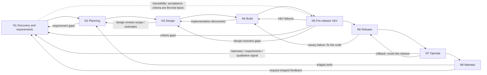

# SDLC Map — AI & Template Overlay

**Status: stable** (reviewed 2026-08-13; review history in `decisions.md`).
Evidence base: `research-modern-qa.md` (citations live there, not here);
structural decisions (which stages get node status; overlay granularity):
`decisions.md`. Both are sibling files in this map's work directory,
`work/sdlc-ai-mapping/` in the template repo.

## If you read nothing else

**What this is:** a map of the software development lifecycle (SDLC) as
eight stages in a graph, with two overlays per stage — where AI genuinely
helps (evidence-tiered) and what this template ships for it. **"The
template"** throughout means `ai-workspace-template`, the AI-workspace
template repository this file lives in — it ships skills, docs, and
conventions for agent-driven development work. **Audience:** anyone
deciding where to point AI or template investment, from leadership
skimming the claims to engineers working inside one stage. **Investment
implication:** AI raises change volume and speed, so the seams between
stages — intake, gates, review, feedback routing — get *more* load-bearing,
not less; invest there. **How to read it:** View 1 is the narrative, View 2
the structure; then jump to your node's entry, and read its Appendix rows
too — the per-artifact human-override guardrails live there. Leadership:
the four claims below plus the gap register's severity column. Engineers
and architects outside the template: your node's **AI helps** line plus the
tag legend; **Template support** bullets are internal to the template and
safe to skip. Template maintainers: the Template support lines and the
gap-register dispositions are yours. Testing is deliberately spread across
N4 + N5 + the Quality lanes — there is no single "testing" section.
Unfamiliar terms are glossed in the Glossary at the end.

Four headline claims:

1. For a live product the dominant delivery loop is
   operate → maintain → plan → build → ship, with discovery running
   *continuously in parallel* — not a front-to-back pipeline.
2. AI is strongest where output is *checkable* (code, tests, contracts,
   coverage diffs, triage) and assistive-only where the artifact encodes
   judgment or authority (priorities, go/no-go, UAT verdicts). The two
   loudest vendor pitches — self-healing tests and autonomous test agents —
   carry no independent evidence [hype].
3. Only Build-stage *techniques* carry [measured]-tier evidence (gated
   unit-test generation, AI-boosted fuzzing); where a technique reappears
   downstream, the tag travels with the technique, not the stage. Every
   other tier rests on practice patterns or author judgment.
4. DORA 2024 caution: AI adoption *amplifies* existing strengths and
   dysfunctions — its data associated more AI use with worse throughput and
   stability (survey-based, correlational).

## Shape of the model

The SDLC is **not a serial pipeline; it is a graph**: a backbone of stages a
*change* flows through, plus feedback edges that make it cyclic, plus
cross-cutting lanes that touch every node. Three structural commitments,
each grounded in the research:

1. **Stages are states, not calendar phases.** Many changes (features,
   fixes) are in flight concurrently, each at a different node. The graph
   also repeats at several granularities — product, epic, feature,
   single PR — the same loop, smaller radius.
2. **Quality is a lane, not a node** — a concern attached to every stage
   rather than a stage of its own, owned by the feature team both earlier
   than coding (shift-left) and out into production (shift-right), with one
   named pre-release V&V (verification & validation) checkpoint for the
   genuinely phase-like activities (regression, UAT,
   sign-off). Verification vs validation kept as distinct tags:
   verification clusters left (CI, review, tests-against-spec); much of
   validation moved right into production (experiments, telemetry).
3. **Feedback edges are first-class.** Production telemetry feeding
   discovery, incidents feeding maintenance, triaged bugs re-entering
   planning — these edges are where a product *lives* after v1; a map
   without them describes only greenfield.

## Two views of the same reality

The lifecycle is presented twice on purpose. The **numbered list** is the
narrative view — the order a single change experiences the stages, easiest
to reason and talk about. The **graph** is the structural view — what the
system of many concurrent changes actually looks like, feedback edges
included. Neither replaces the other.

### View 1 — the narrative (one change's journey)

1. **Discovery & requirements** — decide what to build and how we'll know
   it works (PRD + acceptance criteria).
2. **Planning & prioritization** — decide when, in what order, and in what
   pieces.
3. **Design** — decide how: architecture, domain model, UX, testability.
4. **Build** — implement it, verified as it's made (TDD, review, CI).
5. **Pre-release V&V** — prove it: execute the criteria written in step 1;
   UAT/beta for the human-judgment half (often folded into steps 4/6 by
   continuous-CI teams).
6. **Release** — ship progressively (canary, flags, rings, smoke tests).
7. **Operate** — run it; validation continues against real users
   (SLOs, experiments, telemetry).
8. **Maintain** — keep it healthy: triage, fix-with-regression-test,
   upgrade, refactor; feeds work back to planning.

### View 2 — the graph (the system of changes)

Solid arrows are flow; the dotted arrow is a *correspondence*, not a flow —
explained under Traceability below.

**Edges beyond the forward path** (N7→N8 doubles as a backbone step):

| Edge | Meaning |
|------|---------|
| N7 → N1 | Telemetry, experiment results, and qualitative signal (support themes, user feedback) validate/refute the built thing; spawn new requirements |
| N7 → N8 | Incidents and production bugs enter maintenance (doubles as the backbone step) |
| N8 → N2 | Triaged work re-enters planning (the steady-state loop of a live product) |
| N8 → N1 | Request-shaped feedback (feature asks arriving as tickets) graduates from maintenance into discovery |
| N5 → N4 | V&V failures loop back to build |
| N5 → N1 / N3 | Scenario/criteria gaps found at V&V re-enter discovery (criteria) or design (scenarios only design can know) |
| N6 → N4 | Canary failure — fixing the code (fix-forward, or the fix after a rollback) |
| N7 → N6 | Rollback — reverting the system is a *release* action, distinct from fixing the code |
| N4 → N3 | Implementation discoveries revise design |
| N3 → N2 | Design revises scope and estimates |
| N2 → N1 | Planning exposes requirement gaps |

#### Traceability (correspondence, not flow)

N1 ⇢ N5 — acceptance criteria
written at discovery are the test basis executed at the V&V checkpoint.
The criteria are *maintained* as scope evolves along the way; a stale
criterion silently invalidates the trace.

#### Where the test plan is produced

Unpacking the dotted N1⇢N5 edge —
detail a first read can skim: no single stage — it accretes along
the N1⇢N5 edge and is *executed* at N5. Scenarios are **drafted at N1**
from the PRD (the shift-left move; BDD/SbE lineage); **scoped at N2**
(risk-based depth, definition-of-done; a formal test-plan document, where
required, is assembled here); **enriched at N3** with scenarios only design
can know (failure modes, non-functional targets); **mechanized at N4** into
executable tests; **spent at N5** against the release candidate — N5 plans
nothing new, and scenario gaps discovered there are feedback edges.

#### Steady state

For a live product the dominant *delivery* cycle is
N7 → N8 → N2 → (N3) → N4 → N5 → N6 → N7, while discovery (N1) runs
continuously in parallel — fed by telemetry, experiments, and user research
rather than fronting the pipeline. Big-bang N1-first passes become the
exception; discovery itself does not. Expedited hotfixes cut N8 → N4
directly, skipping planning — the fix still exits through V&V and release.

## Cross-cutting lanes (touch every node)

| Lane | What it is |
|------|-----------|
| **Quality (feature-team-owned)** | The V/V-tagged activity at each node — criteria at N1, testability at N3, TDD/review at N4, regression/UAT at N5, canary/SLO at N6–N7, regression-per-fix at N8 |
| **Quality enablement** | Test infrastructure, test environments & test data, coaching, risk analysis — where modern dedicated-QA sits (Google's SETI/TE — software engineers building test infrastructure/tooling rather than testing by hand — and Atlassian's QA-as-coaching model); natural anchor for AI test tooling |
| **Knowledge & decision capture** | Specs, ADRs, decision trailers, docs — where this template most obviously lives today |
| **Coordination** | Tickets, handoffs, session/agent orchestration, multi-agent workflows |

**Boundary rule:** lanes own the *practice and shared infrastructure*;
nodes own the *instances*. The non-Quality lanes mostly manifest through
shared infrastructure rather than per-node line items, but each does sweep
N1…N8:

| Lane | Sweep across N1…N8 |
|------|--------------------|
| Quality enablement | corpus tooling (N1), risk models (N2), testability coaching (N3), CI/test infra (N4), environments & test data (N5), pipeline health (N6), observability tooling (N7), suite health (N8) |
| Knowledge & decision capture | spec (N1), plans (N2), ADRs (N3), commit trailers (N4), verification evidence (N5), changelogs (N6), postmortems (N7), refreshed docs (N8) |
| Coordination | intake (N1), tickets (N2 and onward), handoffs/briefs at every node |

Some artifacts are dual-homed: tickets are
coordination-lane artifacts instantiated at N2; ADRs are knowledge-lane
artifacts instantiated at N3. Platform/environment engineering lives in the
enablement lane (surfacing at N5 as environment/data readiness) — it has no
node of its own here by design.

## Per-node entries

### Legend — tags used in every node entry

- **AI helps** — each item carries one of four evidence tiers, each with a
  default adoption stance: **[measured]** (published deployment results —
  adopt where the pattern matches), **[established]** (widely practiced
  pattern, tooling claims vary — pilot before standardizing),
  **[heuristic]** (usable, known failure modes — pilot with a human
  override in place), **[hype]** (vendor-claimed, no independent evidence —
  avoid until independent evidence appears).
  Scope honesty: the QA/testing tiers are research-sourced
  (`research-modern-qa.md`); product, AIOps, and other non-QA tiers are
  author judgment applied under the same rubric. Tags are always one of the
  four bare tokens — qualifiers and sources appear in parentheses after the
  tag, not inside it.
- **Quality** — activities carry **[verification]** (does it meet the spec —
  built the product *right*) or **[validation]** (does it meet user needs —
  built the *right* product); see V&V in the Glossary.
- **Product presence** — where product-role judgment stays in the loop
  during the stage; called out (N4–N6) where it is most at risk of being
  assumed away.
- **Template support** — **(native)** = skill/doc/convention shipped in this
  template; **(toolchain)** = external capability the template documents in
  `docs/recommended-tooling.md` or that ships with a runtime; **GAP** =
  no support today (collected in the gap register below).

---

### N1 — Discovery & requirements

- **Activities:** problem framing, opportunity assessment, user research,
  competitive analysis, assumption testing, problem-vs-solution validation,
  PRD/spec writing. Output: a *validated opportunity* plus the PRD — not a
  document alone.
- **Quality:** acceptance criteria / executable examples drafted with the
  PRD — the test basis for N5 [verification]; success criteria — "how will
  we know it works for users" [validation]; assumption/demand testing with
  users [validation]; requirements review for ambiguity and testability
  [verification].
- **AI helps:** synthesizing research corpora (interviews, tickets,
  feedback) [established]; drafting specs/PRDs from conversation
  [established]; drafting Given/When/Then scenarios from a PRD
  [established] (pattern; tooling effectiveness unverified); adversarial
  critique of the plan [heuristic].
- **Template support:** `to-spec` (native) — conversation → spec with
  acceptance criteria per the spec conventions; success-criteria
  requirement in work-item READMEs (native); `## Language` domain glossary
  in CONTEXT.md (native); `rlm` (native) — a query loop over
  corpora too large to read into chat — for analyzing large feedback
  corpora; `grilling`/`grill-with-docs` (toolchain) for plan interrogation;
  `research` skill (toolchain). **GAP (G1 → work item
  `work/feedback-intake/`):** no user-research/feedback *intake*
  convention — nothing routes real user signal into the workspace the
  template scaffolds.
- **Artifacts & guardrails:** Appendix → N1 rows.

### N2 — Planning & prioritization

- **Activities:** roadmap, prioritization — trade-offs under constraint,
  kill/defer decisions, stakeholder negotiation, outcome-over-output focus —
  estimation, decomposition into tickets, sequencing and dependency
  management.
- **Quality:** definition-of-done per ticket [verification]; risk-based
  prioritization of test effort [verification]; tracer-bullet slicing so
  each ticket is independently verifiable [verification].
- **AI helps:** decomposing specs into tickets with dependency edges
  [established]; backlog grooming and duplicate detection [established];
  synthesizing prioritization inputs (usage data, feedback themes,
  capacity) [established]; estimation [heuristic] (weak evidence).
  Prioritization decisions themselves stay human.
- **Template support:** strongest node for the template. `to-tickets`
  (native) — tracer-bullet tickets with blocking edges; `wayfinder`
  (native) — work too big for one session as a map of decision tickets;
  `triage` (native) — the intake side; issue-tracker conventions
  (`docs/agents/issue-tracker.md`, native). No significant gap.
- **Artifacts & guardrails:** Appendix → N2 rows.

### N3 — Design

- **Activities:** architecture, domain modeling, API contracts, UX design,
  threat modeling, technical spikes to de-risk unknowns.
- **Quality:** design review [verification]; testability and failure-mode
  analysis as design constraints [verification]; prototyping to test
  whether the design is the *right* design [validation].
- **AI helps:** generating and critiquing design alternatives [heuristic];
  throwaway prototypes to answer design questions [established]; domain
  modeling and terminology sharpening [established]; architecture queries
  over an existing codebase [established].
- **Template support:** decision capture is the template's core strength
  here — `decision-log` (native), ADRs under `docs/adr/` (native),
  `Decision:` commit trailers (native); graphify (toolchain, wired
  natively) answers "why is it this way" via code→commit→ADR edges;
  `domain-modeling`, `codebase-design`, `prototype`,
  `grill-with-docs` (all toolchain). **GAP (G4 → backlog M27):**
  testability/failure-mode analysis has no prompt or checklist anywhere —
  the quality lane's design station is unmanned.
- **Artifacts & guardrails:** Appendix → N3 rows.

### N4 — Build

- **Activities:** implementation; debugging; unit/integration tests; code
  review; static analysis; CI.
- **Quality:** TDD / tests-with-the-change [verification]; code review
  [verification]; static analysis and linting [verification]; CI quality
  gates [verification]; flaky-test discipline (enablement hygiene — it
  protects gate trust rather than verifying the product).
- **AI helps:** agentic coding [established] (the premise of this
  template); unit-test generation gated by objective filters (build,
  pass, coverage-increase) [measured] (Meta TestGen-LLM — measured
  coverage and acceptance rates, not defect outcomes); AI-boosted
  fuzzing, where fuzzing applies (systems/security-critical code)
  [measured] (Google OSS-Fuzz); code-review assist [established].
- **Costs:** the *verification tax* — agentic output trades writing time
  for review time and can be net-negative on some tasks; and under
  AI-raised volume the constraint moves to the human bottlenecks — review
  latency and CI throughput. The DORA caution applies here hardest: AI
  raises change volume, so gates matter *more* (DORA 2024, survey-based,
  correlational).
- **Product presence:** scope questions and trade-off calls keep arriving
  during build — product doesn't hand off at N2.
- **Template support:** Agent Coding Principles + Context Discipline in
  CONTEXT.md (native); context budget machinery (native) — keeps the
  *agent* inside its quality envelope while building; work-dir
  launcher/ledger (native) for state that survives sessions; worktree
  isolation for concurrent agents (native);
  `docs/operational-knowledge.md` (native) for build/CI gotchas; `tdd`,
  `code-review`, superpowers TDD/debugging (toolchain); graphify update
  after changes (toolchain, wired natively). **GAP (G3, merged into G2 →
  work item `work/quality-gates/`):** no CI quality-gate guidance — the
  template assumes gates exist but says nothing about them (which gates,
  AI-triage of failures, flake policy).
- **Artifacts & guardrails:** Appendix → N4 rows (incl. CI-failure triage).

### N5 — Pre-release V&V checkpoint

- **Activities:** regression suite, E2E, performance/security testing,
  test-environment and test-data readiness, UAT/beta, release sign-off.
  (Running these inside N4/N6's continuous pipelines is the norm — the
  regression suite usually *is* the CI suite; a standalone N5 stage is the
  sign-off/regulated case. Either way the activities exist, which is why
  it stays a node.)
- **Quality:** executing N1's acceptance criteria [verification];
  exploratory testing [validation] (validation in intent — in practice it
  surfaces verification findings too); UAT/beta with real users [validation];
  security review [verification]; sign-off with recorded evidence.
- **AI helps:** E2E scenario drafting [established] (pattern; tooling
  effectiveness unverified — same lineage as N1 scenario drafting);
  LLM-as-judge for natural-language acceptance checks [heuristic] (known
  biases, needs human override); security review assist [heuristic];
  **self-healing tests [hype]**; **autonomous test agents [hype]**.
- **Product presence:** product owns the UAT judgment and is a go/no-go
  voice at sign-off.
- **Template support:** `verification.md` convention (native) is a direct
  hit — plan-before/evidence-after in one file, and its `Covers: S1–S4`
  header *is* the N1⇢N5 traceability edge in file form; spec conventions
  supply the S-numbers (native) — the numbered acceptance criteria S1…Sn
  from the spec; `S1–S4` above is an example; `security-review` (toolchain,
  Claude Code built-in). **GAP (G5 → backlog M28):** no UAT/beta
  coordination support — the validation half of this node (real humans
  judging the real thing) has no template story.
- **Artifacts & guardrails:** Appendix → N5 rows.

### N6 — Release

- **Activities:** CD / deploy automation, versioning, changelogs,
  progressive rollout (canary/flags/rings), smoke tests, rollback. Deploy ≠
  release: flags decouple shipping the code from exposing it to users.
- **Quality:** smoke tests [verification]; canary analysis against
  baseline [verification] (checks the change against expected metrics —
  validation comes later from real-user signal at N7); release gates and
  rollback criteria; the release *is* a production test (shift-right
  premise); delivery health tracked via the DORA four keys (deployment
  frequency, lead time, change failure rate, time to restore — spanning
  N6/N7).
- **AI helps:** changelog/release-notes drafting [established]; deployment
  risk assessment [heuristic]; canary metric analysis [heuristic];
  rollback criteria stay human-owned; execution is increasingly automated.
- **Product presence:** exposure decisions — which users see the change,
  and when flags/rings widen — are product calls.
- **Template support:** thinnest node. `wizard` (toolchain) — generates an
  interactive walkthrough for steps only a human can perform — fits
  cutover/migration runbooks; the `docs/runbooks/` pattern (native) exists but only
  covers workspace setup today; `checkpoint` (native) is a session
  boundary, not a release boundary. **GAP (G7 → out of scope,
  deliberately):** release engineering has no template story — settled as
  out of scope for a coordination template (runbooks + `wizard` are the
  escape hatch); stated here so the omission is explicit.
- **Artifacts & guardrails:** Appendix → N6 rows.

### N7 — Operate

- **Activities:** monitoring, SLOs/error budgets, incident response,
  on-call, A/B experiments, telemetry review.
- **Quality:** SLO compliance and error-budget spend [validation]; A/B
  experiment results [validation]; alert quality (signal/noise)
  [verification] (of the monitoring itself); postmortems (untagged —
  process learning about how we work, neither verification nor validation
  of the product).
- **AI helps:** log/telemetry analysis and anomaly triage [established];
  incident diagnosis assist [heuristic]; postmortem drafting from timelines
  [established]; experiment analysis [heuristic].
- **Template support:** `diagnosing-bugs` / `systematic-debugging`
  (toolchain) transfer to incident work; `docs/operational-knowledge.md`
  (native) is the right home for hard-won operational gotchas; runbook
  pattern (native) extends naturally to operational runbooks. **GAP (G1 +
  G6 → work item `work/feedback-intake/`, backlog M29):** the N7→N1 edge
  is unsupported — no convention routes telemetry, experiment results, or
  incident learnings back into discovery; no postmortem convention either.
- **Artifacts & guardrails:** Appendix → N7 rows.

### N8 — Maintain

- **Activities:** bug triage, fixes, dependency upgrades, refactoring,
  breaking-change migrations (long-running by nature), feature-flag
  retirement, docs upkeep, test-suite health.
- **Quality:** a regression test with every fix [verification]; test-suite
  health (flakiness, runtime) [verification]; docs freshness; deprecation
  hygiene.
- **AI helps:** ticket triage and categorization [established]; bug
  diagnosis [established]; small-scope refactoring and dead-code cleanup
  [established]; large-scale refactoring [heuristic]; dependency-upgrade
  PRs [established]; docs regeneration [established].
- **Template support:** `triage` (native) — the state machine and
  agent-ready briefs are exactly this node's front door; issue-tracker
  conventions (`docs/agents/issue-tracker.md`, native) cover ticket-state
  hygiene — a *generic* backlog convention does not ship; the template
  repo's own backlog practice is template-repo-only and removed on
  adoption (see G9); the work-dir launcher/ledger pattern fits
  long-running breaking-change migrations (native); `onboard-repo` re-runs
  keep repo docs fresh (native);
  `improve-codebase-architecture`, `diagnosing-bugs` (toolchain); graphify
  update keeps the graph honest (toolchain, wired natively). **GAP (G8 →
  backlog L38):** dependency upgrades and test-suite-health monitoring
  have no convention.
- **Artifacts & guardrails:** Appendix → N8 rows.

---

## Gap register (candidate work items / backlog entries)

Invest where AI stresses the seams: AI raises change volume and speed, so
the joints between stages — intake, gates, review, feedback routing — get
*more* load-bearing, not less. This register is that investment list.

Dispositions settled 2026-08-13 with the workspace owner (notes:
`decisions.md`). Dispositions are maintainer-facing: they route each gap
to a landing place inside the template repo — backlog cards (M/L numbers)
live in `docs/template-workspace-backlog.html`, work items under `work/`.

| # | Gap | Node/lane | Severity | Disposition |
|---|-----|-----------|----------|-------------|
| G1 | No user-research / production-feedback intake convention (the N7→N1 edge, and N1's inbound signal) | N1, N7 | High — it's the steady-state loop's first edge | **Work item:** `work/feedback-intake/` (scaffolded 2026-08-13) |
| G2 | Quality-enablement lane unmanned: no guidance on test infrastructure, AI test tooling adoption, or gate policy | lane | High — research says this lane gets *more* load-bearing under AI | **Work item:** `work/quality-gates/` (scaffolded 2026-08-13; absorbs G3) |
| G3 | No CI quality-gate guidance (which gates, AI failure-triage, flake policy) | N4 | Medium | Merged into G2 — gate policy is quality-enablement's first deliverable |
| G4 | No testability / failure-mode-analysis prompt at design time | N3 | Medium | Backlog card **M27** (added 2026-08-13) |
| G5 | No UAT/beta coordination support (validation half of N5) | N5 | Medium | Backlog card **M28** (added 2026-08-13) |
| G6 | No postmortem convention; incident learnings evaporate | N7 | Medium | Backlog card **M29** (added 2026-08-13) |
| G7 | Release engineering absent | N6 | Low | **Out of scope, deliberately** — the template doesn't own deploy machinery; runbooks + `wizard` are the escape hatch |
| G8 | Dependency upgrades & test-suite health unowned | N8 | Low | Backlog card **L38** (added 2026-08-13) |
| G9 | No generic backlog convention ships — the template repo's own backlog practice is template-repo-only, deleted on adoption | N8 | Low | Backlog card **L39** (added 2026-08-13) |

**Next up:** G1 (`work/feedback-intake/`) — the steady-state loop's first
edge — then G2 (`work/quality-gates/`). Dispositions record *routing* as of
their date, not current state; current state lives in each work item's
ledger (`handoff.md`).

## Settled structural questions

Resolved 2026-08-12 (full notes with rejected alternatives: `decisions.md`):

1. **N5 is a real node** — home for phase-like V&V and the traceability
   target; strong-CI teams may collapse it in practice.
2. **N8 keeps node status** — distinct activities with their own
   AI/template story, and the dominant entry point for a live product.
3. **Overlay granularity: per node, lanes tagged inline** — no 8×4 matrix.

## Glossary

Terms used in this document; sources and evidence in
`research-modern-qa.md`.

- **ADR (Architecture Decision Record)** — a short committed document
  capturing one decision: context, choice, rejected alternatives,
  consequences.
- **BDD (Behavior-Driven Development)** — specifying behavior as
  executable Given/When/Then scenarios derived from requirements before
  code (Dan North, 2006).
- **Canary release** — shipping to a small slice of traffic first and
  watching metrics before widening the rollout.
- **CI/CD** — continuous integration (every change merged and
  automatically tested) / continuous delivery-deployment (every change
  releasable, or released, automatically).
- **DoD (Definition of Done)** — the per-ticket checklist that must hold
  before work counts as complete.
- **DORA (DevOps Research and Assessment)** — a research program (founded
  by Forsgren, Humble, Kim; run by Google Cloud since 2018; dora.dev)
  that links engineering practices to delivery performance via large
  annual surveys. Known for the four key metrics — deployment frequency,
  lead time for changes, change failure rate, time to restore — and the
  book *Accelerate* (2018). Cited here for two findings: developer-owned
  continuous testing predicts delivery performance, and (2024–2025) AI
  adoption *amplifies* existing strengths and dysfunctions — its 2024
  data associated more AI use with worse throughput and stability.
  Caveat: survey-based, correlational — strong on "travels together",
  weak on causation.
- **E2E (end-to-end) test** — exercises the whole deployed system through
  its real interface, as a user would.
- **Error budget** — the amount of unreliability an SLO permits; spent
  deliberately on change velocity (Google SRE).
- **Feature flag** — a runtime switch decoupling deploy from release;
  enables progressive exposure and instant kill.
- **Flaky test** — a test that passes and fails nondeterministically on
  the same code; corrosive to gate trust.
- **Given/When/Then** — the BDD scenario format: precondition / action /
  expected outcome.
- **LLM-as-judge** — using a language model to evaluate outputs against
  criteria; useful pre-filter with documented biases (position,
  verbosity, self-preference).
- **Opportunity assessment** — the pre-PRD judgment that a problem is
  worth solving: sizing, evidence of demand, fit with strategy.
- **OSS-Fuzz** — Google's continuous fuzzing service for open-source
  projects; its LLM-generated fuzz targets found real CVEs (evidence for
  [measured] AI fuzzing).
- **Outcome vs output** — measuring success by the change in user/business
  behavior (outcome), not by the volume of things shipped (output).
- **Postmortem (blameless)** — the after-incident record: timeline,
  impact, contributing causes, action items — without individual blame.
- **PRD (Product Requirements Document)** — the product spec: problem,
  users, goals/non-goals, requirements, success metrics.
- **Pre-mortem** — imagining a design has already failed and asking why —
  a failure-mode elicitation technique.
- **Problem vs solution validation** — testing that the problem is real
  and worth solving before testing that a particular solution solves it;
  collapsing the two is a classic discovery failure.
- **Ring deployment** — staged rollout through widening audiences
  (team → beta → world), gated on metrics per ring.
- **SbE (Specification by Example)** — collaboratively refining
  requirements into concrete examples that become executable tests /
  living documentation (Adzic).
- **Shift-left / shift-right** — moving quality work earlier than coding
  (reviews, TDD, criteria-from-PRD) / extending it past release into
  production (canaries, flags, chaos, SLOs, experiments).
- **SLI / SLO** — Service Level Indicator: the measured signal (e.g.
  p99 latency); Service Level Objective: the target it must meet.
- **Smoke test** — a fast, shallow post-deploy check that the system is
  basically alive.
- **Spike (technical)** — a short, timeboxed investigation — often
  throwaway code — to de-risk an unknown before committing to a design.
- **TDD (Test-Driven Development)** — red-green-refactor: write the
  failing test first, then the code that passes it.
- **Test basis** — whatever tests are designed *from* — here, the PRD and
  its acceptance criteria (ISTQB term).
- **TestGen-LLM** — Meta's deployed system generating unit tests gated by
  objective filters (builds, passes, raises coverage); the reference
  point for [measured] AI test generation.
- **Traceability** — the maintained correspondence from requirement to
  test to evidence (S-numbers → scenarios → verification results).
- **Tracer-bullet ticket** — a thin end-to-end slice proving the whole
  path works, rather than a horizontal layer.
- **UAT (User Acceptance Testing)** — real users judging the built thing
  against their needs pre-release; validation, not verification.
- **V&V (Verification & Validation)** — verification: built the product
  *right* (against spec); validation: built the *right* product (against
  user needs) — IEEE/ISO distinction used as tags throughout this map.

## Appendix — Artifacts by node

Artifacts are the payload of the graph's edges: each stage's output is a
later stage's input (the PRD is N5's test basis; verification evidence is
N6's go/no-go input; postmortems and experiment reports are N1's raw
material). Template-covered artifacts are marked; the rest are
product-repo/tooling artifacts the map only locates.

**Pattern across the AI column** (the table in one breath): AI is
strongest where the artifact is *checkable* (code, tests, contracts,
release notes, coverage diffs, triage) and where capture is a by-product
of agent work (ADRs, commits, ledgers); it is assistive-only where the
artifact encodes judgment or authority (priorities, go/no-go, SLO targets,
UAT verdicts, rollback criteria — the rows where "human" appears). The
DORA amplifier caveat applies table-wide: AI-drafted artifacts raise
volume, so the human review points get more load-bearing, not less.

Evidence tiers in the AI column are the four defined once in the per-node
legend. Where a human is irreplaceable, the row says so.

| Node | Artifact | Key contents | AI overlay |
|------|----------|--------------|------------|
| N1 | **Opportunity assessment** | Problem/opportunity sizing, evidence for demand, go/no-go recommendation — the validated-opportunity half of N1's output. | Synthesizes the evidence base and drafts the assessment [established]. The go/no-go call is human. |
| N1 | **PRD / product spec** | Problem statement; target users; goals & non-goals; functional + non-functional requirements; success metrics; open questions. *(template: `work/<effort>/spec.md` per spec conventions)* | Drafts from conversation/notes; critiques for ambiguity and untestable requirements [established]. Goals and priorities stay human. |
| N1 | **Acceptance criteria / scenario drafts** | Given/When/Then per behavior; edge cases; the numbered items (S1…Sn) that N5 traces back to. Often a section of the PRD rather than a separate file. | Drafts scenarios from the PRD; proposes edge cases humans miss [established] (pattern; tooling effectiveness unverified). Human review non-negotiable — these become the release gate. |
| N1 | **Research / evidence pack** | Interview findings, telemetry insights, competitive analysis — the evidence behind the PRD's claims. | Synthesizes large corpora (interviews, tickets, reviews) into themes [established]; per-item classification over big inputs (RLM-style) [established]. |
| N2 | **Roadmap / milestone plan** | Sequenced outcomes, horizons, dependencies between efforts. | Suggests sequencing and surfaces cross-effort dependencies [heuristic]. Prioritization is a value judgment — human. |
| N2 | **Tickets** | Per-ticket scope, definition-of-done, blocking edges, estimate. *(template: `work/<effort>/issues/NN-slug.md` + `map.md`)* | Decomposes a spec into tracer-bullet tickets with blocking edges and drafts DoD [established]. Estimation [heuristic] (weak evidence). |
| N2 | **Test plan (formal, where required)** | Scope & risk assessment; depth per area; environments; entry/exit criteria; responsibilities. Agile-native teams fold this into tickets + acceptance criteria instead. | Drafts a risk-based plan from PRD + design; checks coverage against the requirement list [established] (pattern; tooling effectiveness unverified). Risk weighting reviewed by humans. |
| N3 | **Design / architecture doc** (where warranted — many changes need only an ADR) | Context & constraints; chosen approach; alternatives considered; failure modes; non-functional targets (perf, security, scale). | Generates and critiques alternatives; failure-mode brainstorming (pre-mortem prompts) [heuristic]; drafts the doc from a design discussion [established]. |
| N3 | **ADRs / decision notes** | One decision each: what was chosen, why, rejected alternatives, consequences. *(template: `decisions.md` → `docs/adr/`)* | Near-free with an agent in the loop: drafts the note at the moment of deciding, while reasoning is fresh [established]. Biggest AI win per unit effort on this table. |
| N3 | **API contracts / interface specs** | Endpoints/schemas, error semantics, versioning rules — the machine-checkable half of design. | Drafts schemas from requirements; consistency and breaking-change checks [established] (machine-checkable, so AI output is verifiable). |
| N3 | **Domain model / glossary updates** | Resolved terms, aliases to avoid. *(template: `## Language` in CONTEXT.md)* | Extracts candidate terms and inconsistent aliases from conversations/docs [established]. Term resolution is a team agreement — human. |
| N3 | **UX artifacts** | Wireframes, user flows, throwaway prototypes answering design questions. | Generates working throwaway prototypes fast — collapses the cost of exploring variants [established]. Design judgment on the variants stays human. |
| N4 | **Source code + test suite** | The tests are N1's scenarios mechanized — the executable form of the spec. | Agentic coding [established] (this workspace's premise); unit-test generation gated by objective filters [measured] (Meta TestGen-LLM); fuzz-target generation [measured] (Google OSS-Fuzz). |
| N4 | **CI configuration** | The quality gates as code: which checks block merge, flake policy. | Drafts pipelines and gate configs [established]; triages/clusters CI failures [established]. Gate *policy* (what blocks merge) is human. |
| N4 | **PR / review records** | Diff, review discussion, approvals — the verification trail for each change. | First-pass review: bugs, standards, spec-match [established]. Approval authority stays human — reviewer of last resort. |
| N4 | **Commit messages** | What + why per change. *(template: `Decision:`/`Refs:` trailers)* | Written by the agent that made the change, decision trailers included [established] — another near-free capture point. |
| N5 | **Verification evidence / test report** | Plan (before) + results (after) in one place, perf/security results included; coverage against the S-numbers; gaps visible. *(template: `verification.md`, `Covers: S1–S4`)* | Runs checks, records evidence, and diffs coverage against the S-numbers [established] — the traceability check is mechanical, ideal agent work. |
| N5 | **UAT / beta feedback report** | Real-user findings, severity, sign-off or objections — the validation half. | Clusters and summarizes raw feedback [established]; LLM-as-judge as a *pre-filter* for NL acceptance checks [heuristic] (documented biases, human override required). The UAT judgment itself is irreducibly human. |
| N5 | **Release-readiness record** | Go/no-go decision, known issues shipped with waivers, who signed. | Compiles the evidence into a go/no-go brief [established]. The decision and the signature are human. |
| N6 | **Release notes / changelog** | User-facing changes, breaking changes, upgrade steps. | Generated from commits/PRs — the most automatable artifact on this table [established]. |
| N6 | **Rollout plan** | Ring/canary sequence, gate metrics per ring, rollback criteria and procedure. | Drafts from prior rollouts + change-risk profile [heuristic]. Rollback criteria reviewed by humans — this is the blast-radius control. |
| N6 | **Version/release record + smoke results** | Tag, build provenance, post-deploy smoke outcome. | Plain automation territory; AI adds only anomaly flagging on smoke output [heuristic]. |
| N7 | **SLO definitions + dashboards** | SLIs, targets, error-budget policy — the production quality contract. | Suggests candidate SLIs from traffic patterns; drafts dashboards [heuristic]. Targets encode business tolerance — human. |
| N7 | **On-call runbooks + alert definitions** | Symptom → diagnosis → remediation per known failure mode. | Drafts runbooks from incident history; clusters alert noise to cut false pages [established]. |
| N7 | **Incident postmortems** | Timeline, impact, contributing causes, action items — feeds N8 fixes and N1 insight. | Assembles the timeline from logs/chat/deploy records [established] — removes the tedious half. Causal analysis and blameless framing stay human-led. |
| N7 | **Experiment reports** | Hypothesis, variant results, decision taken — the N7→N1 edge in document form. | Summarizes results and sanity-checks stats (power, peeking) [heuristic]. Ship/kill decisions human. |
| N8 | **Triaged issue records** | Repro, severity, category, agent-ready brief. *(template: `triage` skill output)* | Categorizes, dedups, attempts repro, writes the agent-ready brief [established] — among the highest-leverage AI applications on this table. |
| N8 | **Fix PRs with regression tests** | Each fix carries the test that would have caught it. | Diagnoses and fixes with the regression test attached [established]; the test half benefits from the gated-generation pattern [measured] (TestGen-LLM). |
| N8 | **Upgrade / migration notes** | Dependency changes, breaking-change handling, verification performed. | Drives upgrade PRs and summarizes breaking changes from changelogs [established]. |
| N8 | **Refreshed repo docs** | Code-structure/design/api docs kept current. *(template: `onboard-repo` outputs)* | Regenerates docs from code — the docs-rot countermeasure [established]. |

Cross-cutting lane artifacts (produced at *every* node): decision notes/ADRs
(knowledge lane), work-item launcher/ledger and briefs (coordination lane),
test-infrastructure and environment configs (enablement lane),
and the backlog itself. AI makes these near-free — an agent in the loop can
capture decisions, ledger entries, and backlog updates as by-products of the
work, which is precisely this template's operating premise.

