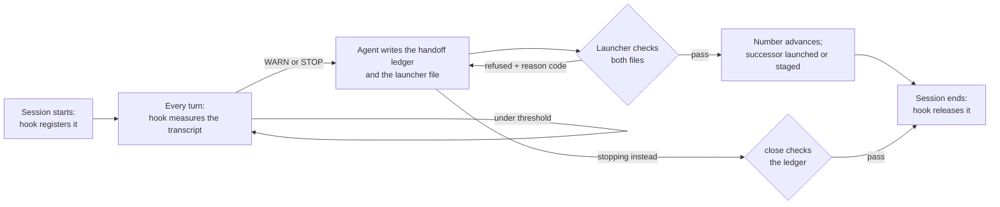
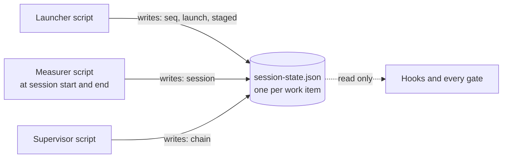
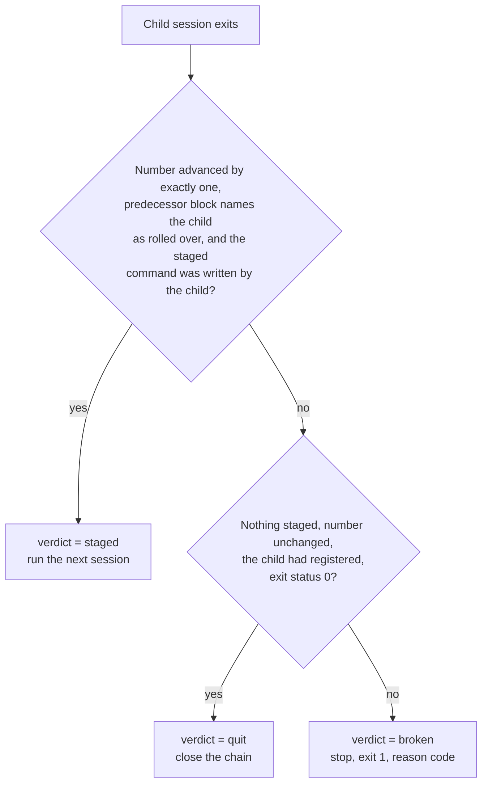
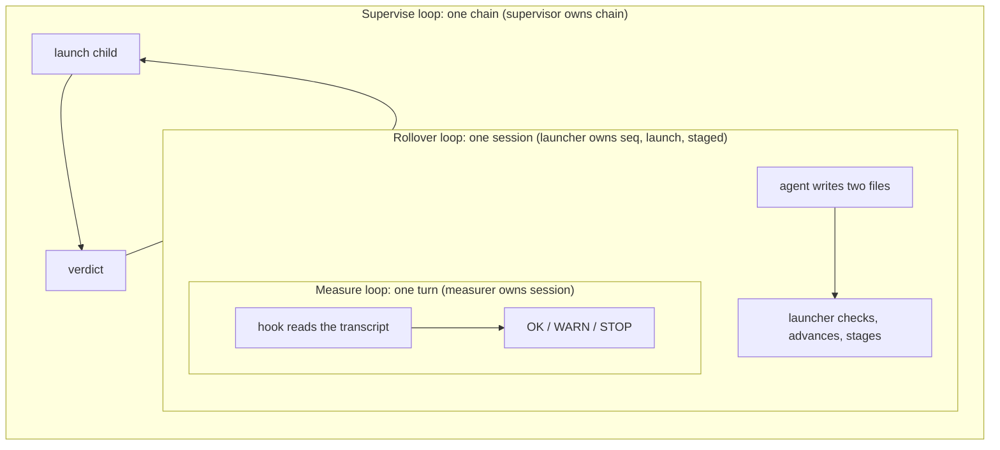

# Session management — design v2 (2026-09-15)

> Rewrite of the Stage 2 design after three independent reviews (architect, scenario walk, developer). Consensus amendments and cuts are applied; the three points that needed the user's decision were settled on 2026-09-15 (option (a) each; see the Decisions section). Accepted design; supersedes Part 2. Pointers into the workspace are footnotes only.

## What this is

An LLM coding agent works in a session with a finite context window, and its quality drops well before the window is full. This subsystem measures how full the window is from the runtime's own transcript on disk, and when a threshold is crossed it hands the work to a fresh session through two files and one small state record. A supervisor script can run that hand-off unattended, session after session, as a chain. The operator is the agent itself, which can forget or hallucinate, so every load-bearing step is a script with an exit code, and each step refuses to run if the previous step's evidence is missing.

## One-page summary

- **One record per work item** (`work/<item>/session-state.json`, not committed) holds everything about the current launch: the session number, who launched it and how, which session owns it, what is staged for the next session, and the chain budget. Three scripts write it, each owning its own part; hooks and gates only read it.
- **A session owns a work item** while its process is alive; the process id plus its start time is the only liveness test. A human can always take the item over with one flag.
- **Rolling over** means: the agent writes the handoff ledger and the launcher file, then runs the launcher. The launcher checks both files itself (right block number, valid shape, launcher file replaced since the session started), refuses with a reason code and the repair command if anything is missing, and otherwise advances the session number and launches or stages the successor.
- **The successor finds its number without guessing.** On attached launches the launcher passes it in the environment; on an in-place restart the process id matches; whoever explicitly registers against an open launch becomes that session.
- **The supervisor** runs sessions in a chain and reaches exactly one of three verdicts after each child exits: *staged* (run the next one), *quit* (close the chain), *broken* (stop and report a code).
- **Session numbers are never reused.** A session that vanished is closed as abandoned at the next launch and the gap is noted in the ledger.
- **Each runtime is one row in an adapter table** (where its transcript is, how to count tokens, which hook fires when). A runtime is "supported" for a mode only after the corresponding probe script has passed on it.
- **Sub-agent fleet machinery** moves into its own script with its own state and tests; the daily loop never calls it.
- **Removed from the earlier draft:** the background-daemon launch path, the agent-run options sync, the separate prep and verify verbs, the vendor exit-reason field, the timestamp stamps on every block, and about a third of the reason codes.

## The session lifecycle

Under each arrow the gate is a script with an exit code: 0 pass, 4 refused with `reason=<code>` and the one command that repairs it. The only step no script can force is the first one after STOP: the agent has to *begin* the rollover. The hook repeats the STOP message every turn until it does, and under a supervisor a watchdog pages after a timeout.[^stop]

## The record and its three writers

Every write goes through one helper: read, apply a filter, write a temp file in the same directory, rename. The helper refuses if the filter fails or produces nothing, takes a directory-based lock for the few milliseconds of the write, and each writer's filter carries its own precondition (for example, the release at session end changes nothing unless the record still names the calling session as owner).[^lock] Two cross-block writes are sanctioned by rule: the launcher empties `session` when it advances the number, and registration empties `launch.pending` when it binds.

| Block | Written by | Fields that something reads |
|---|---|---|
| `seq` | launcher (registration may open it once on an item that has no record yet) | the session number, monotonic |
| `launch` | launcher | `launched_at`, `by` (session or supervisor), `mode` (interactive or hands-off), `options` (permission mode captured from the transcript at launch), `predecessor` {`seq`, `session_id`, `registered_at`, `disposition` = rolled over / stopped / abandoned}, `pending` {`pid`, `pid_start`, `prompt`} for in-place restarts |
| `session` | measurer | `seq`, `runtime`, `session_id`, `pid`, `pid_start`, `artifact` (transcript path), `registered_at`, `launcher_hash` (taken at registration), `user`, `ended` {`at`, `door` = stop} |
| `staged` | launcher (supervisor clears it when consumed) | `successor` (the number), `command`, `by` (the session id that staged it) |
| `chain` | supervisor | `supervisor` {`pid`, `pid_start`, `started_at`}, `used`, `cap`, `closed` {`at`, `by_seq`, `reason`} |

Everything else from the earlier draft (per-block author stamps, the vendor exit reason, a duplicate supervisor pid, launch path and reason strings, chain timestamps) was read by nothing and is gone.

## Who is alive

A session owns a work item while the process id in the record is running and was started at the time the record says. That pair is the only liveness test on every runtime that has a process of its own; where a runtime has none, the transcript's last-modified time is the fallback. A human can overwrite the owner with `--takeover`; it is logged with the loser's identity.[^liveness]

## How the successor finds its number

The successor's session id does not exist until it starts, so the launcher leaves a binding that the successor's start hook can match without guessing. On attached launches and under the supervisor the work item and number travel in two environment variables. On an in-place restart (Claude's `/clear`) the process is the same, so its id and start time match the `pending` block. **Whoever explicitly registers against an open launch (number advanced, owner empty) becomes that session**; no scan, no time window. A session that matches nothing registers without a work item and only measures itself. The earlier draft's background-daemon launch path is deleted: the environment is captured by the first daemon and replayed into later sessions, so it could never be bound exactly, and any plain session started in the time window could have claimed it.[^bg]

## The supervisor's decision

The verdict reads only fields a script wrote atomically at the launcher's bump (`launch.predecessor` and `staged.by`) plus the number before and after; it never depends on a watchdog snapshot of the child.[^verdict] Before each child the supervisor checks the chain budget, stages a command through the launcher if none is staged, exports the number for that iteration, records the child in `chain`, and runs it. Its watchdog pages (past STOP with nothing staged; staged but still alive) fire in both modes; silence-based pages fire only in hands-off mode, because in interactive mode the human at the keyboard is the stall detector. A child may end its own turn with a signal only when a supervisor is recorded as live; a hand-run stage without one is refused.

## The three loops

## The gates and their refusal codes

| Step | Script | Refuses when |
|---|---|---|
| register at start | measurer | never blocks; a session that is not the owner is measured but cannot roll the item over (`not_owner`); a live different owner keeps the slot (`owner_live`); the item is `adopted` when the owner is dead or is this same process |
| measure each turn | measurer | exit 0 / 1 / 2 for OK / WARN / STOP; `jq_missing` printed once if the JSON tool is absent (checked before any parsing) |
| launch or stage | launcher | `not_owner`, `owner_live`, `chain_closed`, `supervised_stage_only` (a plain launch while a supervisor is live), `ledger_seq_mismatch`, `ledger_shape`, `launcher_unchanged`, `launcher_stale` (git has newer history the launcher file predates), `worktree_unsynced`, `runtime_path_unsupported`, `no_supervisor` (staging by hand with no supervisor), `schema_mismatch` |
| close (stop door) | measurer | `not_owner`, `ledger_seq_mismatch`, `ledger_shape` |
| supervisor start | supervisor | `record_unreadable`, `schema_mismatch`, `chain_closed` (unless reopening), `supervisor_live`, `relaunch_off` |
| supervisor verdict | supervisor | `staged`, `quit_stop`, `quit_plain`, `cap`; broken: `rc_nonzero`, `logout`, `staged_invalid leg=<which>`, `no_own_measurement`, `record_unreadable`, `schema_mismatch`, `stall` |

The file checks run inside the launcher and `close` at the moment they act; `--check` runs the same checks without changing anything, for the agent to use while writing. There is no separate prep or verify step and no verification stamp to go stale.[^inline] Detail after a code travels as `key=value` on the same line; log text is free-form and never a test contract.

## Runtimes

| Runtime | Attended rollover | Supervised chain | Note |
|---|---|---|---|
| Claude Code | supported | supported | the only runtime exercised so far |
| Codex | unverified | unverified | session id from the environment; logout shape not yet captured |
| Copilot CLI | unverified | unverified | session id is the newest transcript, a heuristic (**DECISION 3**) |
| Gemini | unverified, attended only | unsupported | no exit hook; one shared transcript, so identity is constant |

Each runtime is one row in an adapter table: where the transcript lives, how to count tokens, where the session id comes from, which hook registers and which ends a turn, and what "logged out" looks like. One hook dispatcher script produces each vendor's payload. A runtime with no hooks is unsupported; there is no polling layer.

## Tests

Tests pin three observable things and nothing else: the exit code, record fields, and the reason code. Each suite builds a throwaway git workspace from a fixture helper. Every end-to-end probe is a script that checks its own pass criteria; probes that need a vendor login are acceptance runs, and each has a stub-runtime twin that is the CI contract. Logout fixtures for Codex and Copilot are captured by whoever first runs the supervised probe on them.

## Non-goals

Multiple people on one item; supervising VS Code agent mode or Gemini; the OpenCode runtime beyond a shim; per-turn ledger records; Windows; long compatibility shims (one-time import of the old counter only); a background-daemon launch path; a JSON output mode.

## Decisions (settled by the user, 2026-09-15: option (a) in all three)

1. **Logout on Codex / Copilot CLI.** The reviewers split. (a) Drop the "unknowable" code path: those quits read as plain quits and the support matrix says "logout not classified"; reopening a wrongly closed chain is one command. (b) Keep a `logout=unknowable` suffix so the gap is visible in tests. *Recommended: (a), less code for a gap the matrix already states.*
2. **A predecessor resumed after it staged a successor.** (a) Whoever registers against the open launch becomes that session: no number spent, no unstage verb, no probe for it. (b) Refuse the second launch, mark the number abandoned, mint the next one. *Recommended: (a); it removes a verb, a code and a question, and involves no judgement about whether anything was consumed.*
3. **Session identity on Copilot CLI (and Gemini).** The id is the newest transcript, so "is this session the owner" is a heuristic there. (a) Accept it and say so in the matrix while those runtimes are unverified. (b) Require an explicit `--session-id` on those runtimes. *Recommended: (a).*

Settled by all three reviewers and adopted above: at WARN the agent asks only when relaunch is set to manual or off; process liveness is the sole oracle; the background-daemon launch path is gone; the numbering gap for an abandoned session is accepted.

## Glossary

- **Session** — one run of an agent runtime with one context window and one transcript file.
- **Work item** — a directory under `work/` holding one project's files, ledger and record.
- **Session number** — the position of a session in a work item's history; never reused.
- **Record** — the one JSON file per work item that says what launch is open, who owns it, what is staged, and the chain budget.
- **Owner** — the session the record names; the only session allowed to roll the item over.
- **Rollover** — handing work to a fresh session: write the two files, pass the gates, launch or stage.
- **Handoff ledger** — the append-only history file, newest block on top; one block per session.
- **Launcher file** — the forward-looking instructions the successor reads first; replaced each rollover.
- **Staged command** — the successor's launch command, written by the launcher for the supervisor to run.
- **Supervisor / chain** — the script that runs sessions back to back, and the sequence it runs.
- **Verdict / reason code** — the supervisor's outcome for a child, and the short token every refusal or verdict prints.
- **Runtime adapter** — the table row that tells the scripts how one agent runtime stores and reports its session.

[^stop]: Stage 1 and all three Stage 3 reviewers agree this step is irreducible without a blocking hook; it is recorded as such in the mechanical-gates ADR. Supervised mode has the `past_stop_unstaged` page as a backstop.
[^lock]: Developer review §2: `flock` is absent on macOS, `mkdir` is atomic on both; compare-and-set preconditions turn a lost race into a no-op. `release` merges into `ended`, never replaces it.
[^liveness]: Accepted decision 4 of Part 1b; the process walk already exists in `scripts/context-budget.sh`. Fallback applies to VS Code agent mode and Gemini only.
[^bg]: Probe B in `evaluation/stage2-probes.md`; architect review §1(e) and coupling C9; scenario cut C2; developer §7 Q2.
[^verdict]: Architect §1(d) and scenario amendment A1 both rewrite the verdict on `launch.predecessor`. The scenario reviewer also keeps a "registered after launched" leg; the architect drops it because `disposition = rolled_over` is written only when the caller was the registered owner. The simpler form is used here.
[^inline]: Architect §1(h) keeps a separate `verify` verb with snapshot-free predicates; scenario amendment A3 runs the same checks inline in the launcher with a `--check` dry-run. The inline form is used here (one verb and one stamp fewer, both ordering traps gone). Artefact checks fire only when the caller is a session, never on the supervisor's bootstrap bump.
